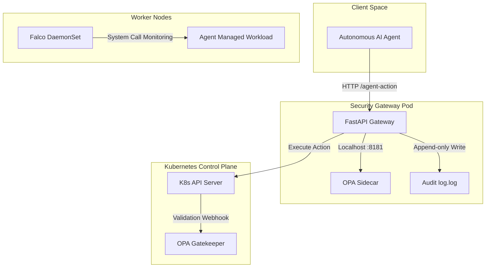
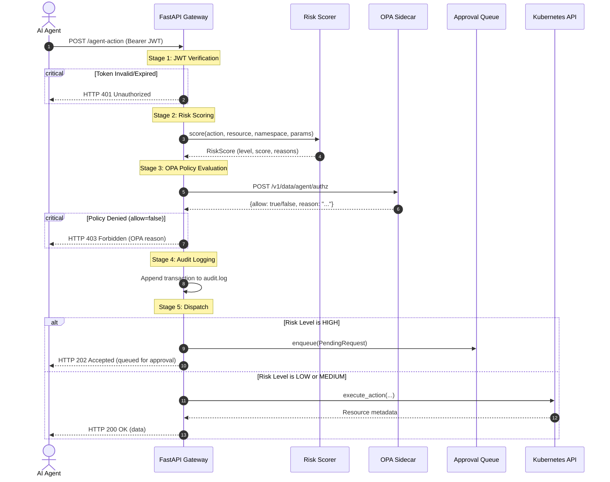

# System Architecture — AI Agent Kubernetes Security Gateway

This document provides a detailed breakdown of the system architecture, security design, and request lifecycle for the AI Agent Kubernetes Security Gateway.

## Architecture Overview

The system implements a **three-layer defense-in-depth architecture** to protect a Kubernetes cluster from untrusted autonomous AI agents:

1. **Layer 1: Policy-Enforcement Gateway (FastAPI)**: Evaluates incoming requests using a rule-based risk scorer and an external OPA policy engine, routing high-risk requests to an approval queue.
2. **Layer 2: Admission Control (OPA Gatekeeper)**: Enforces policies directly at the Kubernetes API server level, blocking any direct requests that bypass the gateway.
3. **Layer 3: Runtime Threat Detection (Falco)**: Monitors system calls in real-time inside active containers to detect post-deployment compromises.

---

## The 5-Stage Request Lifecycle

Every agent request submitted to the gateway passes through the following synchronous stages before reaching the Kubernetes API server:

### Stage 1: Cryptographic Authentication
- Every request must present a short-lived JSON Web Token (JWT) in the `Authorization: Bearer` header.
- Tokens carry the subject (`sub`) identifying the agent and a `role` claim (e.g. `readonly`, `deployer`).
- The JWT is verified using the symmetric key (`Settings.jwt_secret`) and algorithm (`Settings.jwt_algorithm`). Invalid signatures or expired tokens are rejected immediately with `HTTP 401`.

### Stage 2: Dynamic Risk Scoring
- The risk scoring module (`app/risk/scorer.py`) inspects the action verb, target namespace, target resource, and the resource payload (`params`).
- **Content-Aware Parameters**: The scorer extracts configuration details (like `privileged`, `hostNetwork`, `hostPID`, untrusted registries, and replica counts) to increment the base score.
- Output is a unified `RiskScore` containing a raw score, a category (`low`, `medium`, or `high`), and a list of human-readable justifications.

### Stage 3: Out-of-Process Policy Decision (OPA)
- The gateway queries a local Open Policy Agent (OPA) sidecar process over HTTP `localhost:8181`.
- The request body, including the client role, target namespace, resource, and complete payload (`params`), is evaluated against Rego rules (`policies/agent_actions.rego`).
- If OPA denies the action, the gateway fails fast and returns `HTTP 403 Forbidden` with OPA's compiled justifications.

### Stage 4: Immutable Transaction Logging
- Every non-401 request is appended to a thread-safe, structured JSONL file (`audit.log`).
- The log entry records the transaction metadata, raw risk score, OPA policy reasons, and the final dispatch decision.
- Logging is designed to be fail-safe: any I/O errors are trapped and reported without interrupting request execution.

### Stage 5: Orchestration & Dispatch
- If OPA allows the action, the gateway decides whether to execute it or place it in the queue based on the risk level.
- **Low/Medium Risk**: Forwarded to the Kubernetes API wrapper (`app/k8s/client.py`).
- **High Risk**: Placed in an in-memory queue (`app/approval/queue.py`), returning `HTTP 202 Accepted` with a `request_id`.
- **Human Resolution**: An operator inspects the queue via `GET /pending` and approves/denies via `POST /approve/{id}`. Upon approval, the gateway executes the workload on Kubernetes and writes a second matching audit record capturing the human's choice.

---

## Security Threat Modeling & Design Patterns

### Failing Closed
The gateway's connection to the OPA policy sidecar is wrapped in a fail-closed exception handler. If the OPA sidecar crashes, is shut down, or fails to respond within a 5-second timeout, the gateway returns `HTTP 403 Forbidden`. Under no circumstances is a policy engine failure treated as an implicit "allow".

### Least Privilege Dispatch Tables
Instead of forwarding arbitrary JSON manifests or strings to the Kubernetes API server (acting as a blind reverse proxy), the gateway's Kubernetes client utilizes a strict **dispatch table** (`app/k8s/client.py`). The gateway only exposes explicit operations (e.g. `list_pods`, `create_deployment`) and translates parameters into tightly bound objects. If an agent tries to modify a resource type not registered in the dispatch table, it is rejected programmatically.

### Admission Bypasses (Layer 2 & 3 Guardrails)
Since credentials could be leaked or Kubernetes service account tokens stolen, the gateway is not the sole line of defense:
- **OPA Gatekeeper** blocks non-conforming configurations (such as privileged containers, untrusted registries, and missing resource limits) at the Kubernetes admission control level.
- **Falco** detects zero-day exploits, post-compromise actions (e.g. running a shell inside an active container), or cryptomining executables at the OS kernel level.
