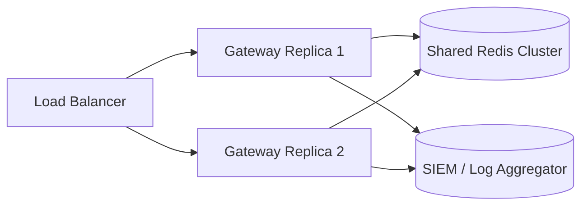

# Project Roadmap & Milestones — AI Agent Kubernetes Security Gateway

This document outlines the milestones, roadmap, and horizontal scaling design choices for the AI Agent Kubernetes Security Gateway.

---

## Roadmap Overview

```
   Phase 1: Foundation (Current)     Phase 2: Enterprise Persistence     Phase 3: Observability & Scale
 ┌──────────────────────────────┐   ┌───────────────────────────────┐   ┌───────────────────────────────┐
 │ • fastapi pipeline & scoring  │   │ • redis approval queue        │   │ • multi-agent telemetry       │
 │ • OPA sidecar integration    │──>│ • asymmetric JWT auth (RS256) │──>│ • distributed tracing (OTel)  │
 │ • gatekeeper constraints     │   │ • database audit archiving    │   │ • active agent rate limiting  │
 │ • falco runtime security     │   │ • policy hot-reloading        │   │ • dynamic policy generation   │
 └──────────────────────────────┘   └───────────────────────────────┘   └───────────────────────────────┘
```

---

## Milestones

### Milestone 1: Zero-Trust Perimeter (Phase 1) — **COMPLETED**
- Implement FastAPI request orchestrator.
- Establish HS256-based short-lived JWT authentication.
- Implement Out-of-Process Open Policy Agent (OPA) policy evaluation.
- Design a rule-based content-aware risk scorer.
- Implement thread-safe JSONL transactional audit logging.

### Milestone 2: Multi-Layer Guardrails (Phase 1) — **COMPLETED**
- Deploy OPA Gatekeeper Admission Controller with 3 constraint types:
  - `K8sNoPrivilegedContainer` (blocking privileged/hostNetwork/hostPID pods).
  - `K8sAllowedRepos` (blocking untrusted container registries).
  - `K8sRequireLimits` (forcing resource requests and limits).
- Deploy Falco DaemonSet with custom runtime rules targeting web shells, cryptominers, package installations, and credential theft.

### Milestone 3: Production Hardening (Phase 2) — **PLANNED**
- **Durable State**: Replace in-memory approval queue with Redis cluster storage.
- **Asymmetric Encryption**: Migrate from HS256 to RS256 JWT signatures. Gateways decrypt and verify signatures using public keys (`JWKS` endpoint), while the identity provider holds the private key.
- **Audit Archiving**: Sync append-only JSONL files to a central, immutable log repository (e.g., Elasticsearch, AWS S3, or Splunk).

### Milestone 4: Cloud-Scale Observability (Phase 3) — **PLANNED**
- **Distributed Tracing**: Integrate OpenTelemetry (OTel) to trace requests from the AI agent through the gateway, OPA engine, and Kubernetes API.
- **Distributed Rate Limiting**: Implement Token Bucket rate limiting per agent ID using Redis to mitigate denial-of-service attempts by misbehaving loops.

---

## Horizontal Scaling Architecture (Phase 2/3)

When scaling the gateway to multiple replicas, the architecture must change to support shared state and zero-trust clustering:



1. **Shared Stateful Queue**: Storing pending approvals in a shared Redis cluster allows replica 1 to receive a request and replica 2 to process the human approval.
2. **Stateless Gateway Pods**: Since JWT authentication is cryptographic, replicas do not need session affinity. Replicas only need the public signing key to verify requests.
3. **Log Shipping**: Instead of writing to local persistent volumes, each replica streams audit lines directly to a unified log pipeline (Fluentbit/Logstash -> Elasticsearch/Splunk) for centralized security analysis.
